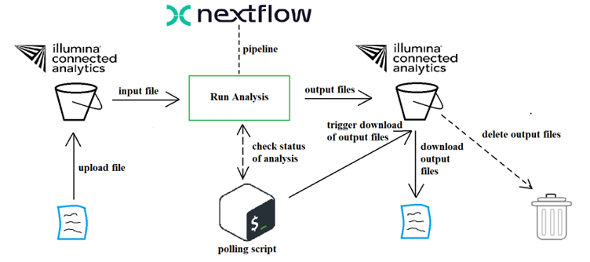

# ica-v2-poc   
## Introduction   
This is a simple proof of concept (POC) for automating certain processes that use the _Illumina Connected Analytics (ICA)_ CLI. The main processes that we wish to automate are:   

- uploading files for analysis
- run Nextflow pipelines for analysis
- trigger download of output file(s)
- delete output file after download succeeds   

We can use a combination of both the [API](https://ica.illumina.com/ica/api/swagger/index.html#/) and the [CLI](https://help.ica.illumina.com/command-line-interface/cli-indexcommands). However, we will almost exclusively use the CLI.   

Before we can begin, we need to have an existing project or create a new project. For the rest of this README, we'll be referring to the existing project, **SGDP**.   

## Authentication
Authentication is required in order to use the API or the CLI. After logging in to the UI, an API key needs to be created. Instructions for generating an API key can be found over [here](https://help.ica.illumina.com/account-management/am-iam#api-keys).   

There are two ways to authenticate in order to make use of the API:
1. API key + JWT for the entire API, except for the POST `/tokens` endpoint.
2. API key + Basic Authentication (username/email and password) for the POST `/tokens` endpoint.    

When using the CLI, authentication takes place when running the command:
```bash
icav2 config set
```
There will be prompts. The defaults can be used by simply pressing `Enter` or `Return`. When the API key is prompted, provide the value that has been generated in the UI. 
```bash
icav2 config set
Creating $HOME/.icav2/config.yaml
Initialize configuration settings [default]
server-url [ica.illumina.com]: 
x-api-key : myAPIKey
output-format (allowed values table,yaml,json defaults to table) : 
colormode (allowed values none,dark,light defaults to none) :
```
The `$HOME/.icav2/config.yaml` file can be modified if the default settings are wished to be changed. In our case, our output format is JSON.   

Our goal is to create a process for the uploading of data to ICA, starting a pipeline run (or analysis) of the uploaded data, check the status of the analysis or output files periodically, download the results, and then finally clean up the storage in ICA (delete output and uploaded files). A diagram illustrating a single file upload-analysis-download-delete process can be seen below:   
   

When running the **DRAGEN Germline Whole Genome 4-3-6** pipeline using a .bam file as input, the .bam indexes (.bai) are required when _realignment is disabled_.   
  
This pipeline is still undergoing tests.   

The idea is to write all necessary data to a `.txt` file as the workflow implements the different processes. This is an example of what the `data.txt` file would look like:   

```txt
sampleId:ERR1019050
read1:fil.85255ad2588d4e5fe75a08dcaabcc45f
read2:fil.6bcfeca6252941dde75b08dcaabcc45f
ref_tar:fil.2e3fd8d802ee4963da2208dc484ea8f0
analysisId:9aa57a35-7e66-4d4e-9c05-729767ff0290
analysisRef:regan_dragen_germline_whole_genome_test_05-DRAGEN Germline Whole Genome 4-3-6-a7f59145-3f93-4579-9129-c2b726dc4414
outputFolderId:fol.7cdafdb7363062eef75b08edbbcdd56a
```

