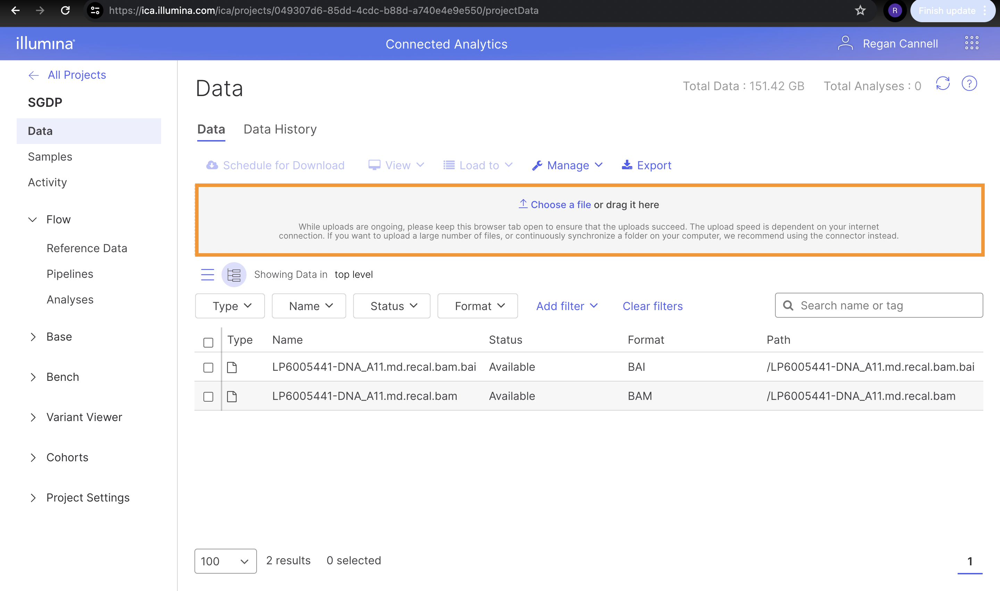
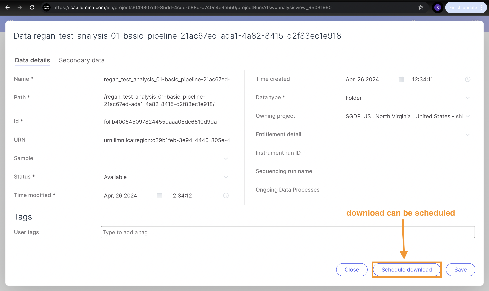
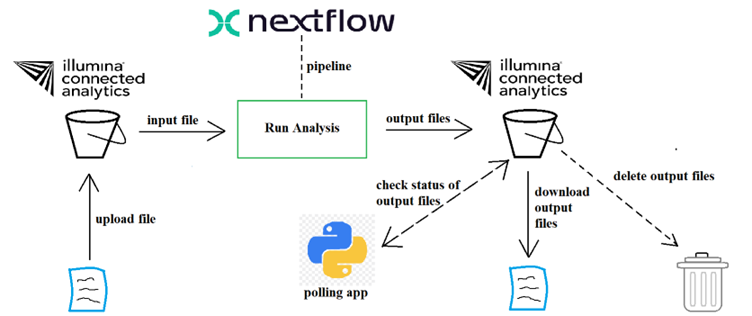

# ica-v2-poc   
## Introduction   
This is a simple proof of concept (POC) for automating certain processes that use the _Illumina Connected Analytics (ICA)_ API. The main processes that we wish to automate are:   

- uploading files for analysis
- run Nextflow pipelines for analysis
- trigger download of output file(s)
- delete output file after download succeeds   

We can use a combination of both the [API](https://ica.illumina.com/ica/api/swagger/index.html#/) and the [CLI](https://help.ica.illumina.com/command-line-interface/cli-indexcommands).   

Before we can begin, we need to have an existing project or create a new project. For the rest of this README, we'll be referring to the existing project, **SGDP**.   

## Authentication
Authentication is required in order to use the API or the CLI. After logging in to the UI, an API key needs to be created. Instructions for generating an API key can be found over [here](https://help.ica.illumina.com/account-management/am-iam#api-keys).   

There are two ways to authenticate in order to make use of the API:
1. API key + JWT for the entire API, except for the POST `/tokens` endpoint.
2. API key + Basic Authentication (username/email and password) for the POST `/tokens` endpoint.    

When using the CLI, authentication takes place when running the command:
```bash
icav2 config set
```
There will be prompts. The defaults can be used by simply pressing `Enter` or `Return`. When the API key is prompted, provide the value that has been generated in the UI. 
```bash
icav2 config set
Creating /Users/regancannell/.icav2/config.yaml
Initialize configuration settings [default]
server-url [ica.illumina.com]: 
x-api-key : myAPIKey
output-format (allowed values table,yaml,json defaults to table) : 
colormode (allowed values none,dark,light defaults to none) :
```
The `/Users/regancannell/.icav2/config.yaml` file can be modified if the default settings are wished to be changed.

## Project and Project Data   
A project can be created in the UI. After a project is created, the project object can be obtained by using the following `curl` command with the API:
```bash
curl -X 'GET' \
  'https://ica.illumina.com/ica/rest/api/projects?includeHiddenProjects=false' \
  -H 'accept: application/vnd.illumina.v3+json' \
  -H 'X-API-Key: XXXXXXXXXXXXXXXX'
```
The response body will contain a JSON object with a lot of details about the project. (The object is too big to be displayed here).   

## Uploading Files to Illumina Connected Analytics   
We can use the UI to upload a file to a project.   


The CLI can also be used to upload a file. We can get a list of projects with the following CLI command:
```bash
icav2 projects list
```
From the returned object (which is JSON by default), the `projectId` should be noted, since it will be required in subsequent commands/requests. To set the project context, run the following command:
```bash
icav2 projects enter <projectId>
```
If the command runs successfully, then a response like
```bash
"Context switched to project <projectId>"
```
should be received. Now the terminal session will be in the specified project's context. It's possible to now upload a file to the project with:
```bash
icav2 projectdata upload <localFileFolder>
```
If a remote path for uploading is not specified, the data will be uploaded to the top level of the project's storage folder.   

The API can also be used for uploading data. Data for the project can be created by using the following `curl` command:
```bash
 curl -X 'POST' \
 'https://ica.illumina.com/ica/rest/api/projects/{projectId}/data' \
 -H 'accept: application/vnd.illumina.v3+json' \
 -H 'X-API-Key: XXXXXXXXXXXXXXXX' \
 -H 'Content-Type: application/vnd.illumina.v3+json' \
 -d '{
 "name": "gencode.v45.lncRNA_transcripts.fa",
 "folderId": "fol.579eda846f1b4f6e2d1e08db91408069",
 "dataType": "FILE"
 }'
```
The example above generated a partial file called `gencode.v45.lncRNA_transcripts.fa` within our project, and is situated inside a folder with the folder ID `fol.579eda846f1b4f6e2d1e08db91408069`. The project, file, or folder IDs can be accessed either by logging into the ICA web UI or by using the ICA V2 CLI.   

To get details about the data of the project, the `id` of the project needs to be sent as a path parameter in the following request:
```bash
curl -X 'GET' \
  'https://ica.illumina.com/ica/rest/api/projects/{projectId}/data?filePathMatchMode=STARTS_WITH_CASE_INSENSITIVE' \
  -H 'accept: application/vnd.illumina.v3+json' \
  -H 'X-API-Key: XXXXXXXXXXXXXXXX'
```

## Downloading Files from Illumina Connected Analytics   
Files can be downloaded from the ICA storage using the CLI with the following CLI command:
```bash
icav2 projectdata list # take note of the dataId
icav2 projectdata download <dataId>
```

## Run Nextflow Pipelines   
A Nextflow pipeline can be created in the web UI. A tutorial on creating a Nextflow pipeline and running an analysis through the web UI can be found over [here](https://help.ica.illumina.com/tutorials/nextflow). Once the pipeline is created, the CLI can be used to get a JSON object of the pipeline and all its details:
```bash
icav2 pipelines get <pipelineId>
```
The analysis from the example in the tutorial takes about 30 minutes to complete. When completed, there is output data in the ICA storage. The analysis has an `id`, so the CLI can be used to get the status of the analysis:
```bash
icav2 projectanalyses get <analysisId>
```
We could also use a GET request to the API as follows:
```bash
curl -X 'GET' \
  'https://ica.illumina.com/ica/rest/api/projects/049307d6-85dd-4cdc-b88d-a740e4e9e550/analyses/387b5178-732f-4706-9c41-e67a0cd00dc6' \
  -H 'accept: application/vnd.illumina.v4+json' \
  -H 'X-API-Key: XXXXXXXXXXXXXXXX'
```
The JSON response contains a lot of information, but we are interested in the status of the analysis, i.e.
```json
{
	"analysisPriority": "MEDIUM",
	"analysisStorage": {
		"description": "1.2TB",
		"id": "6e1b6c8f-f913-48b2-9bd0-7fc13eda0fd0",
		"name": "Small",
		"ownerId": "8ec463f6-1acb-341b-b321-043c39d8716a",
		"tenantId": "f91bb1a0-c55f-4bce-8014-b2e60c0ec7d3",
		"tenantName": "ica-cp-admin",
		"timeCreated": "2021-11-05T10:28:20Z",
		"timeModified": "2023-05-31T16:38:26Z"
	},
	"endDate": "2024-04-26T12:48:02Z",
	"id": "387b5178-732f-4706-9c41-e67a0cd00dc6",
	"ownerId": "f030a442-4aa3-3bf1-acf0-25f76194603f",
	"pipeline": {
		"analysisStorage": {
			"description": "1.2TB",
			"id": "6e1b6c8f-f913-48b2-9bd0-7fc13eda0fd0",
			"name": "Small",
			"ownerId": "8ec463f6-1acb-341b-b321-043c39d8716a",
			"tenantId": "f91bb1a0-c55f-4bce-8014-b2e60c0ec7d3",
			"tenantName": "ica-cp-admin",
			"timeCreated": "2021-11-05T10:28:20Z",
			"timeModified": "2023-05-31T16:38:26Z"
		},
		"code": "basic_pipeline",
		"description": "Reverses a fasta file and outputs to stdout.",
		"id": "bfecca03-6443-45bd-b313-e4f555cd0748",
		"language": "NEXTFLOW",
		"languageVersion": {
			"id": "2483549a-1530-4973-bb00-f3f6ccb7e610",
			"language": "NEXTFLOW",
			"name": "20.10.0"
		},
		"ownerId": "f030a442-4aa3-3bf1-acf0-25f76194603f",
		"pipelineTags": {
			"technicalTags": []
		},
		"tenantId": "02ea1bcf-6b20-4cbf-a9b2-724d1833eb07",
		"tenantName": "sbimb-wits",
		"timeCreated": "2024-04-26T12:23:56Z",
		"timeModified": "2024-04-26T12:23:56Z",
		"urn": "urn:ilmn:ica:pipeline:bfecca03-6443-45bd-b313-e4f555cd0748#basic_pipeline"
	},
	"reference": "regan_test_analysis_01-basic_pipeline-21ac67ed-ada1-4a82-8415-d2f83ec1e918",
	"startDate": "2024-04-26T12:34:19Z",
	"status": "SUCCEEDED",
	"summary": "",
	"tags": {
		"referenceTags": [],
		"technicalTags": [],
		"userTags": [
			"regan"
		]
	},
	"tenantId": "02ea1bcf-6b20-4cbf-a9b2-724d1833eb07",
	"tenantName": "sbimb-wits",
	"timeCreated": "2024-04-26T12:34:11Z",
	"timeModified": "2024-04-26T12:48:04Z",
	"userReference": "regan_test_analysis_01"
}
```
We would like to download the output files after the analysis is complete and successful, i.e. the status should be **"SUCCEEDED"**. The possible values are:
- REQUESTED 
- QUEUED 
- INITIALIZING 
- PREPARING_INPUTS 
- IN_PROGRESS 
- GENERATING_OUTPUTS 
- AWAITING_INPUT 
- ABORTING 
- SUCCEEDED 
- FAILED 
- FAILED_FINAL 
- ABORTED   

## Trigger Download of Output File(s)   
The output data files can be downloaded from the ICA storage using the web UI. A download can even be scheduled through the web UI.   

   

We would like to poll the status of the analysis and then trigger a download process as soon as the status reaches **"SUCCEEDED"**. After a successful download, we can then delete the files from the ICA storage.   

## Delete Output File   
To delete data from a project, the following CLI command can be used:
```bash
icav2 projectdata delete <path or dataId>
```
The full process for a simple upload-analysis-download-delete mechanism can be seen in the diagram below:   

   
